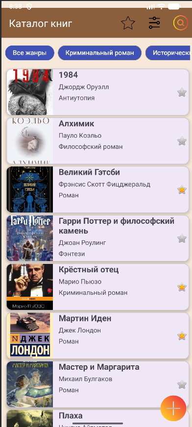
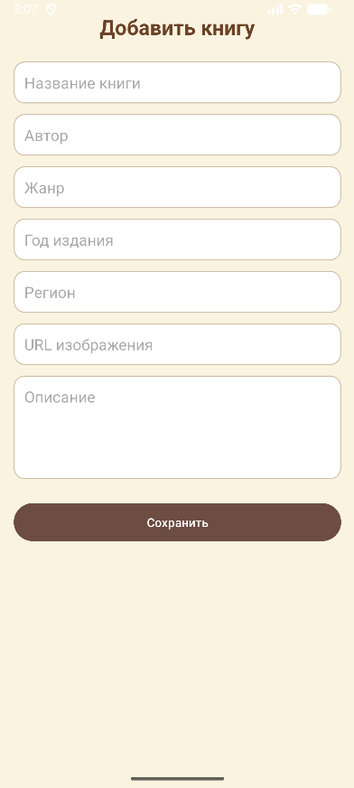
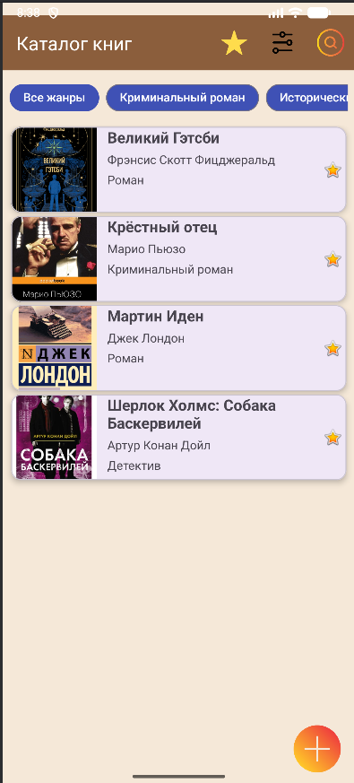

📚 Book Catalog App
Android-приложение для управления личной библиотекой книг.
Позволяет просматривать список книг, добавлять новые, отмечать избранные и просматривать подробную информацию о каждой книге.

Возможности

📖 Просмотр списка книг

➕ Добавление новой книги

⭐ Добавление книг в избранное

📝 Просмотр детальной информации о книге

🔍 Поиск по названию и автору

💾 Локальное хранение данных (Room Database)

Используемые технологии

Java

Android SDK

Room (SQLite)

ViewModel & LiveData (MVVM)

RecyclerView

Material Design

------------------------------------------------------------------------
## 🎥 Демонстрация

[▶️ Смотреть видео](screenshots/demo.mp4)

## 📱 Главный экран
Список всех книг с возможностью:
- просмотра информации о книге
- перехода к экрану деталей
- добавления новой книги в библиотеку

---

## 📖 Детали книги
Экран с подробной информацией о выбранной книге:
- название и автор
- жанр и год издания
- описание
- добавление в избранное

---

## ➕ Добавление книги
Экран для добавления новой книги в библиотеку:
- ввод названия, автора и жанра
- сохранение книги в локальную базу данных

---

## ⭐ Избранное
Список книг, добавленных пользователем в избранное,  
для быстрого доступа к любимым книгам.

